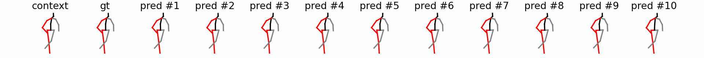
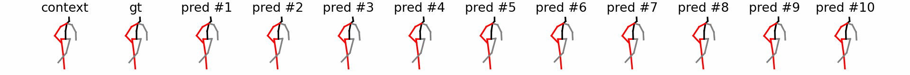
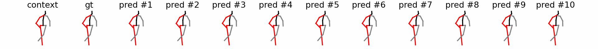

# SwiftDiff

[Sibo Tian](https://scholar.google.com/citations?hl=en&user=fv-tcZIAAAAJ)1, [Minghui Zheng](https://engineering.tamu.edu/mechanical/profiles/zheng-minghui.html)1,\*, [Xiao Liang](https://engineering.tamu.edu/civil/profiles/liang-xiao.html)2,\*

1J. Mike Walker ’66 Department of Mechanical Engineering, Texas A&M University, 2Zachry Department of Civil and Environmental Engineering, Texas A&M University, \*Corresponding Authors

Complete documentation and code will be available when the paper is published.

## 🎞 Demos of Human Motion Prediction

More prediction demos can be found in `./assets`.

#### 1. Human3.6M -- Walking
##### TransFusion

##### One-step TransFusion

##### SwiftDiff

##### SwiftDiff_balance

