# Real-Time 3D Motion Prediction for Human-Robot Collaboration via Bayesian-Optimized Diffusion Models (SwiftDiff)

[Sibo Tian](https://scholar.google.com/citations?hl=en&user=fv-tcZIAAAAJ)<sup>1</sup>, [Minghui Zheng](https://engineering.tamu.edu/mechanical/profiles/zheng-minghui.html)<sup>1,\*</sup>, [Xiao Liang](https://engineering.tamu.edu/civil/profiles/liang-xiao.html)<sup>2,\*</sup>

<sup>1</sup>J. Mike Walker ’66 Department of Mechanical Engineering, Texas A&M University, <sup>2</sup>Zachry Department of Civil and Environmental Engineering, Texas A&M University, <sup>\*</sup>Corresponding Authors

## 📢 News

**Inference Code for Human3.6M and AMASS released to reproduce the results showing in following tables!**
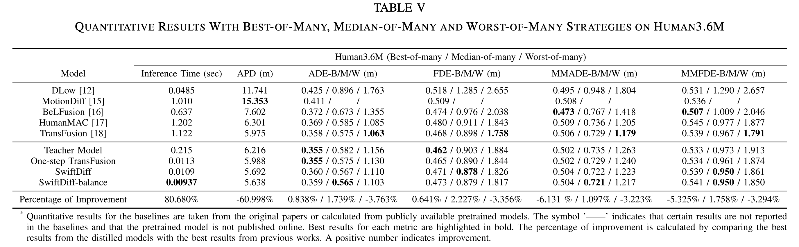
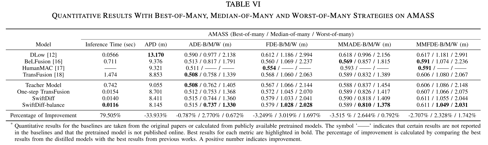

## 🛠 Setup

### 1. Python/Conda Environment
Please follow the instruction from install.sh

### 2. Datasets
For Human3.6M, we adopt the data preprocessing from [GSPS](https://github.com/wei-mao-2019/gsps). For AMASS, we carefully adopt the data preprocessing from [BeLFusion](https://github.com/BarqueroGerman/BeLFusion). We provide all the processed data [here](https://drive.google.com/drive/folders/1J_8XyZC_sgRYZg6TQm09ZhlcsjjYO9Y8?usp=sharing) for convenience. Download all files into the `./data` directory and the final `./data` directory structure is shown below:

```
data
├── data_3d_amass.npz
├── data_3d_amass_test.npz
├── data_3d_h36m.npz
├── data_3d_h36m_test.npz
└── data_multi_modal
    ├── data_candi_t_his25_t_pred100_skiprate20.npz
    └── t_his25_1_thre0.500_t_pred100_thre0.100_filtered_dlow.npz
```
### 3. Pretrained Models

We provide the pretrained models for both datasets [here](https://drive.google.com/drive/folders/1MuRrlfELg6bI0aHpAQTNPmbzzHzlNckR?usp=sharing). Download all files into the `./checkpoints` directory and the final `./checkpoints` directory structure is shown below:

```
checkpoints
├── swiftdiff_amass.pt
├── swiftdiff_h36m.pt
├── swiftdiff_balance_amass.pt
└── swiftdiff_balance_h36m.pt
```
## 🔎 Evaluation
Evaluate on Human3.6M:

```
python main.py --cfg h36m --mode eval --ckpt './checkpoints/swiftdiff_h36m.pt' --num_layers 12 --latent_dims 768
```

```
python main.py --cfg h36m --mode eval --ckpt './checkpoints/swiftdiff_balance_h36m.pt' --num_layers 10 --latent_dims 768
```

Evaluate on AMASS:

```
python main.py --cfg amass --mode eval --ckpt './checkpoints/swiftdiff_amass.pt' --num_layers 16 --latent_dims 896 --multimodal_threshold 0.4
```
```
python main.py --cfg amass --mode eval --ckpt './checkpoints/swiftdiff_balance_amass.pt' --num_layers 10 --latent_dims 896 --multimodal_threshold 0.4
```

## 🎞 Demos of Human Motion Prediction on HRC Dataset

#### 1. Case 1 in the paper -- Fig. 7
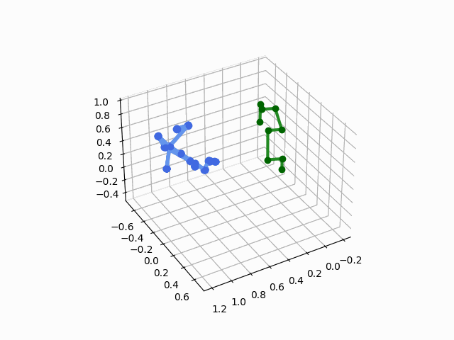
#### 2. Case 2 in the paper -- Fig. 8
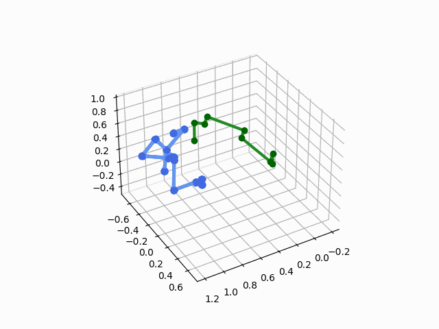

## 🎞 Demos of Human Motion Prediction on Benchmark Datasets

#### 1. Human3.6M -- Walking
##### TransFusion
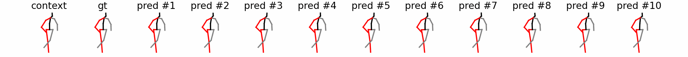
##### One-step TransFusion
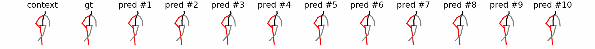
##### SwiftDiff

##### SwiftDiff_balance
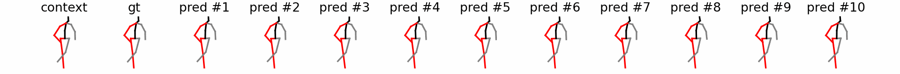
#### 2. Human3.6M -- Walk Together
##### TransFusion
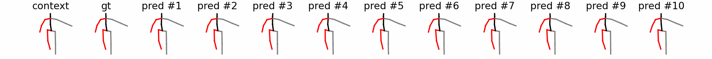
##### One-step TransFusion
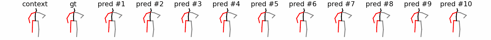
##### SwiftDiff
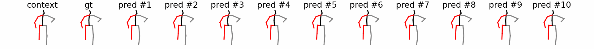
##### SwiftDiff_balance
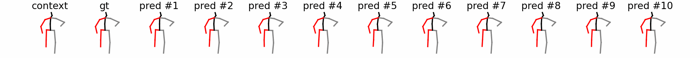
#### 3. Human3.6M -- Photo
##### TransFusion
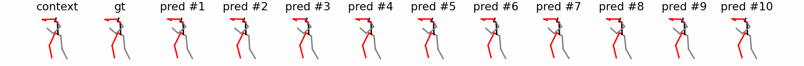
##### One-step TransFusion
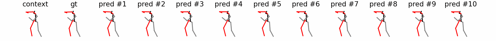
##### SwiftDiff
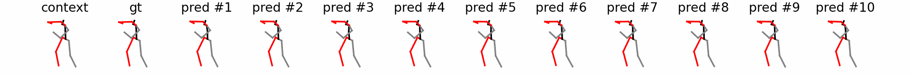
##### SwiftDiff_balance
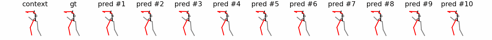
#### 4. AMASS -- SSM
##### TransFusion
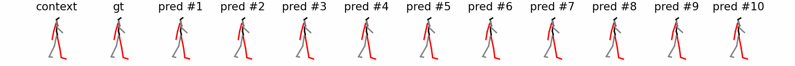
##### One-step TransFusion
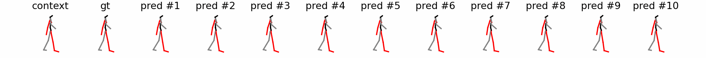
##### SwiftDiff
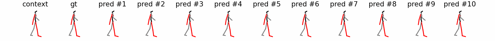
##### SwiftDiff_balance
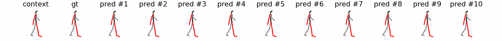
#### 5. AMASS -- DanceDB
##### TransFusion

##### One-step TransFusion
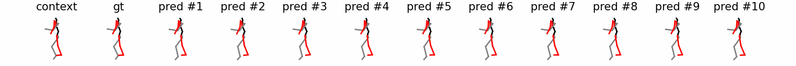
##### SwiftDiff

##### SwiftDiff_balance
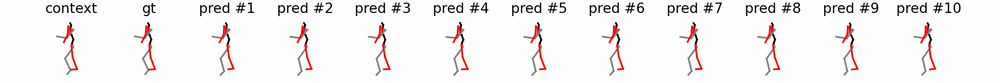
#### 6. AMASS -- DFaust
##### TransFusion
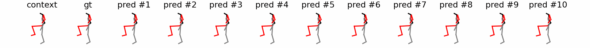
##### One-step TransFusion

##### SwiftDiff
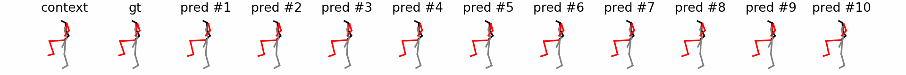
##### SwiftDiff_balance
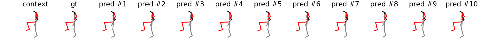
